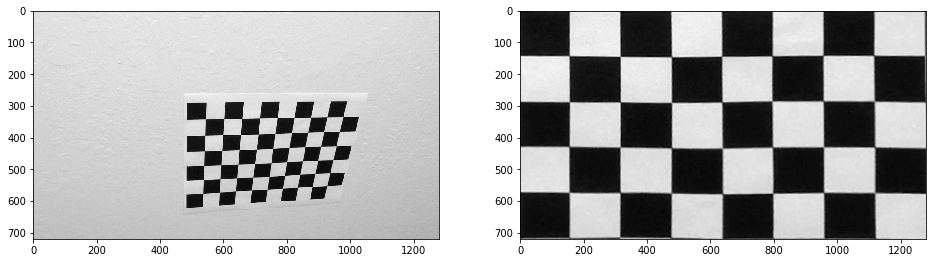
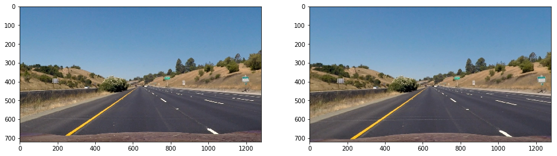
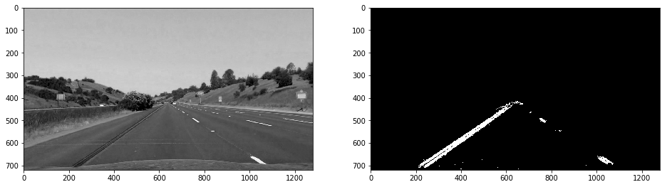
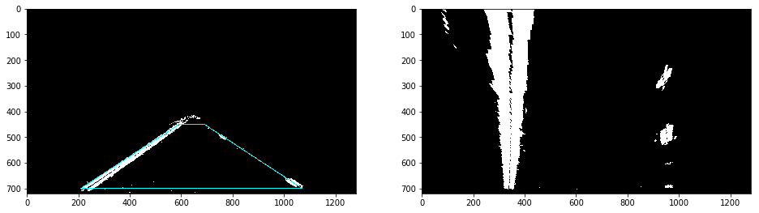
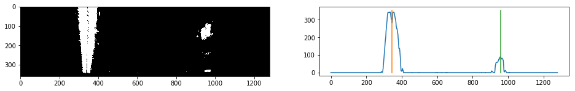
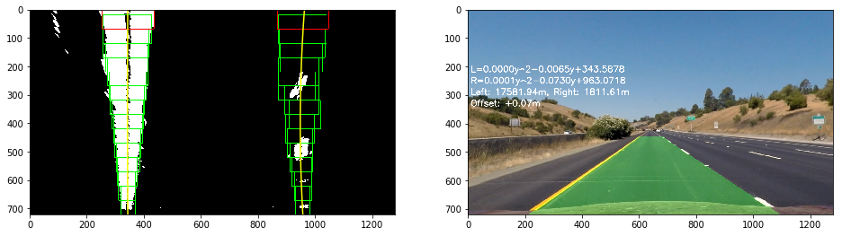
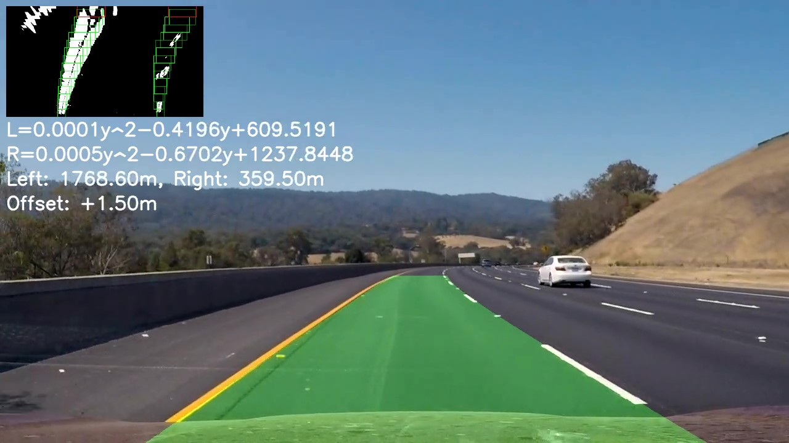

# Advanced Lane Finding Project

The goals / steps of this project are the following:

* Compute the camera calibration matrix and distortion coefficients given a set of chessboard images.
* Apply a distortion correction to raw images.
* Use color transforms, gradients, etc., to create a thresholded binary image.
* Apply a perspective transform to rectify binary image ("birds-eye view").
* Detect lane pixels and fit to find the lane boundary.
* Determine the curvature of the lane and vehicle position with respect to center.
* Warp the detected lane boundaries back onto the original image.
* Output visual display of the lane boundaries and numerical estimation of lane curvature and vehicle position.

---
Please see full code in the [Jupyter notebook](./AdvancedLaneLines.ipynb).

## Camera Calibration

*1. Briefly state how you computed the camera matrix and distortion coefficients. Provide an example of a distortion corrected calibration image.*

The code started with an array of object points for the grid. Then it goes thru each chessboard image in `camera_cal/calibration*.jpg` to find the chessboard corners by calling `cv2.findChessboardCorners(...)`. If found, it will collect both object points and the points of actual corners in the image. At the end it passes all object points and image points to `cv2.calibrateCamera(...)` to obtain camera matrix, distortion coefficients, etc.

## Pipeline (single image)

*Provide an example of a distortion-corrected image.*

Here are images before and after distortion correction is applied.

*2. Describe how (and identify where in your code) you used color transforms, gradients or other methods to create a thresholded binary image. Provide an example of a binary image result.*

See `get_threshold_binary(img)` function in the notebook for full code.

Given a distortion corrected image in RGB color space, it will first convert it to a image HLS color space. Specifically to its S channel, it will apply *Sobel* operator in both X axis and Y axis to get the gradient binaries in both directions. Then will use the gradients to obtain thresholded magnitude-based and direction-based binaries.

In the early phase of this project, the binary output is a union of these binaries. To help "window sliding" technique (described in later section) better tracking the lanes bottom-up, binaries based on *Canny* edge detection was added later. For example, if it is a blank "window", it will remain its previous position. Edge detected by Canny method lows the number of blank "windows" in a image frame.

The output is determined by 

`img[((gradx == 1) & (grady == 1) & (magnitude == 1) & (direction == 1)) | (canny == 1)] = 1`

Binary image is trimmed for just the triagle area at the bottom, because the trimmed information does not contribute to anything.

*Describe how (and identify where in your code) you performed a perspective transform and provide an example of a transformed image.*

See `perspective_transform(img, overlayed=None)` function in the notebook for full code.

Here is a mapping between source points and destination points to be passed over to `cv2.getPerspectiveTransform(...)` function in order to obtain the tranformation matrix `M`.

| source      | destination |
|-------------|-------------|
| [592, 450]  | [320, 50]   |
| [689, 450]  | [960, 50]   |
| [1071, 700] | [960, 700]  |
| [209, 700]  | [320, 700]  |

*3. Describe how (and identify where in your code) you identified lane-line pixels and fit their positions with a polynomial?*

See `curvature_detection(img, old_l_samples=[], old_r_samples=[], img_c=None)` function in the notebook for full code.

Based on whether historical left/right samples `old_l_samples`, `old_r_samples` are provided, the function will use different ways to decide which left/right positions, `lp`, `rp`, to start with for lane searching. If samples are provided, `lp`, `rp` will be assigned with positions found at the bottom of the samples, `old_l_samples[0, 0]`, `old_r_samples[0, 0]`; else, it will call `lp, rp = peak_detection(img)`. In situation where previous image frame does not provide enough information for the current frame, it can always set `old_l_samples`, `old_r_samples` to `[]` to force peak detection from scratch.

Peak detection function takes bottom half of the thresholded binary image from previous step, accumulate the values across image width to obtain a histogram like shown below.

Provided starting points `lp`, `rp`, the curvature detection function begins tracing lanes in the thresholded binary image within series of left and right "windows", show as green boxes in the example below. It uses `np.convolve(...)` function to identify the new `lp`, `rp` points at each window level.

When one of the lane lines is dashed, it is possible nothing can be found within a search window. In this case, it will make a guess based on the other lane line and a lane width. A window that has nothing found within it will be drawn as red box, as shown in the image above.

After the window sliding search, a list of left and right samples are collected and passed over to `np.polyfit(...)`. Lane fit model will be returned. 

*4. Describe how (and identify where in your code) you calculated the radius of curvature of the lane and the position of the vehicle with respect to center.*

See `add_curvature_overlay(img, l_fit, r_fit, l_fit_r, r_fit_r, M)` function in the notebook for code.

*5. Provide an example image of your result plotted back down onto the road such that the lane area is identified clearly.*

See `add_curvature_overlay(img, l_fit, r_fit, l_fit_r, r_fit_r, M)` function in the notebook for full code.

## Pipeline (video)

Here's the [link to my video result](./project_video.mp4).

# Discussion

*6. Briefly discuss any problems / issues you faced in your implementation of this project. Where will your pipeline likely fail? What could you do to make it more robust?*

One problem that got solved later was, earch "window" was in fixed size in early implementation. However due to perspective transformation, the real lane line appears in changing widths, where width of top portion seems to be larger than width of bottom portion of the image, as seen above. Auto increasing search window width helps in this situation.

The pipeline is likely to fail when noisy in the image increases.

To make it more robust, I figure maybe a mathematical model of lanes should be defined, in order to add constraints to search.